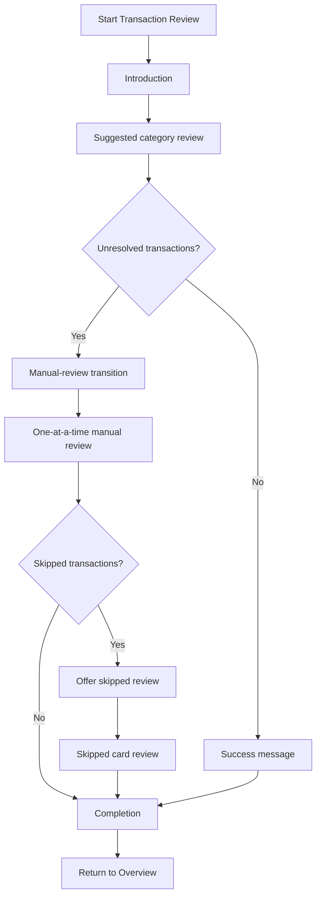

# Tally Transaction Review — Feature Integration Plan

## Purpose

Replace Tally's existing **Review with AI** button and the entire **Review with AI** page with a guided **Transaction Review** workflow.

The new experience should feel like a conversation led by Tally. Tally first presents its category suggestions in efficient groups, then helps the user manually categorize anything it could not confidently place or anything the user rejected.

The workflow must remain user-controlled. Tally may suggest categories and learn vendor-to-category suggestion rules, but it must **never automatically approve or submit future transactions**.

---

## Product Goals

1. Help users process uncategorized transactions quickly without reviewing every charge individually.
2. Build trust by clearly separating Tally's suggestions from user approval.
3. Make incorrect suggestions easy to remove and resolve later.
4. Let users explicitly teach Tally how to suggest categories for a vendor in the future.
5. Preserve completed work if the user exits before finishing.
6. Provide an accessible manual-review alternative to drag-and-drop.

## Non-Goals

- Automatically approving future transactions based on vendor rules.
- Automatically creating vendor suggestion rules without user consent.
- Requiring every transaction to be categorized before the user can finish.
- Adding vendor-rule creation to the manual drag-and-drop phase in this version.
- Retaining the existing Review with AI page.

---

## Terminology

- **Transaction:** An imported bank charge that may need categorization.
- **Envelope:** A user-created budget category with a previously selected icon.
- **Envelope group:** One of the three high-level groups: **Needs**, **Wants**, or **Savings**.
- **Suggested transaction:** A transaction for which Tally has already reached its existing minimum confidence threshold and proposed an envelope.
- **Unresolved transaction:** A transaction that Tally could not suggest an envelope for or that the user removed from a suggested group.
- **Vendor suggestion rule:** A user-approved rule telling Tally to suggest a particular envelope for future transactions from that vendor. It does not approve those transactions.
- **Review session:** One user visit to the workflow. Completed approvals persist even if the session ends.

---

## Entry Point

### Replace the existing experience

- Remove/replace the current **Review with AI** button.
- Remove/replace the entire existing **Review with AI** page.
- The new entry button label is **Start Transaction Review**.

### Button states

- If uncategorized transactions exist, enable **Start Transaction Review**.
- If no uncategorized transactions exist, disable the button and show **All caught up**.

### Introduction screen

Selecting **Start Transaction Review** opens an introduction screen rather than immediately displaying transactions.

The introduction should explain that:

- Tally will review uncategorized transactions with the user.
- Tally will first group transactions into the envelopes it believes are correct.
- The user will approve or remove those suggestions.
- Remaining transactions will be reviewed individually afterward.

Primary CTA: **Start Review**.

---

## End-to-End Flow



---

## Phase 1: Suggested Category Review

### Which transactions appear

- Use Tally's existing category-suggestion logic and confidence threshold.
- Every uncategorized transaction for which Tally has made a category suggestion appears in this phase.
- Transactions for which Tally could not suggest a category do not appear here. Add them to the unresolved backlog for Phase 2.
- If an envelope has no suggested transactions, skip it automatically. Do not show an empty review step for it.

### Review order

Present envelope groups in this order:

1. Needs
2. Wants
3. Savings

Within each group, follow the user's existing envelope order.

### App-led presentation

Tally should lead each step conversationally, for example:

> I found several transactions that look like they belong in Dining. Remove anything that doesn't belong, then approve the rest.

Display one envelope/category at a time. Show its icon and name prominently.

### Suggested transaction list

Use one scrollable list, even when a category contains many suggestions.

Each transaction row must show:

- Merchant
- Amount
- Date
- Time
- Remove control (**X**)
- Future vendor-suggestion toggle

### Removing a suggestion

Selecting the **X** beside a transaction must:

1. Remove only that individual transaction from the current category group.
2. Place it in the unresolved backlog for Phase 2.
3. Record that Tally should stop suggesting this category for that vendor in future cases.
4. Leave any other transactions from the same vendor in the current group unchanged.

The user may still approve other same-vendor transactions already displayed in the current session. The correction affects future suggestions, not the remaining current list.

### Empty group after removals

If the user removes every transaction from the group:

- Keep the category step visible.
- Show an empty state.
- Require confirmation before proceeding.
- Do not automatically advance.

Suggested CTA: **Confirm None Belong Here**.

### Future vendor-suggestion toggle

The toggle means:

> Suggest this envelope for future transactions from this vendor.

It does **not** mean:

- Automatically categorize future transactions.
- Automatically approve future transactions.
- Skip future review.

Behavior:

- For a vendor with no saved rule, the toggle defaults to **off**.
- The user must actively enable it.
- Enabling it does not immediately save the rule.
- Save enabled rules when the category group is approved.
- If a saved rule already exists for that vendor and envelope, show the toggle as **on**.
- Turning an existing rule off deletes that saved vendor suggestion rule when the revised category group is approved.
- Future matching charges may be suggested in that envelope, but must still enter the normal review and approval process.

### Approving a category

When the user selects **Approve**:

1. Categorize every transaction still present in the group into the displayed envelope.
2. Persist those assignments immediately.
3. Update affected envelope balances immediately.
4. Save enabled vendor suggestion rules and delete saved rules switched off in this group.
5. Advance to the next envelope with suggested transactions.

### Revisiting approved categories

- Provide a **Back** button that moves through previously reviewed categories.
- The user may revisit any approved category by moving backward one category at a time.
- On a revisited category, the user may remove transactions and approve the revised group.
- A newly removed transaction becomes uncategorized again, updates the envelope balance, and enters the unresolved backlog.
- Reapproval persists the revised group and rule states.

---

## Transition to Phase 2

After all suggested category groups have been reviewed:

- If unresolved transactions exist, show a short transition message explaining that the remaining transactions need individual attention, including the **count of unresolved transactions**.
- Then begin Phase 2.
- If no unresolved transactions exist, show a brief success message and proceed to the completion state.

Example transition copy:

> Great—your suggested matches are reviewed. 7 transactions still need your help, so we'll go through those one at a time.

The count ensures users understand the scope of work remaining before they enter the manual-review phase.

---

## Phase 2: Manual Transaction Review

### Included transactions

Phase 2 contains:

- Transactions Tally could not confidently categorize.
- Transactions the user removed from a suggested category.

### Order

Present transactions chronologically from earliest to latest, using both date and time.

### One-at-a-time transaction card

Show a single transaction at a time as a card containing:

- Merchant
- Amount
- Date
- Time

Below the card, display the user's envelopes.

### Envelope layout

- Every envelope must use the icon selected when that envelope was created.
- Organize envelopes under **Needs**, **Wants**, and **Savings** as the initial layout.
- Within each group, preserve the user's existing envelope order.

The exact responsive visual layout within those groups may be determined during implementation.

### Assigning a transaction

Support both:

1. Dragging the transaction card onto an envelope.
2. Clicking/tapping an envelope to select it.

Either interaction submits the assignment immediately, updates the relevant envelope balance, and advances to the next transaction. Do not require a separate confirmation step. The Redo behavior provides recovery from mistakes.

Do not show or create future vendor suggestion rules during manual review in this version. This decision is intentionally deferred.

### Manual-review controls

#### Skip

- **Skip** sets the transaction aside and advances to the next transaction.
- Skipped transactions are not categorized.

#### Redo

- **Redo** moves backward by exactly one previously reviewed transaction per selection.
- Repeated selections allow the user to step backward through all transactions reviewed during the current session.
- Reopening a transaction must reverse or allow replacement of its prior assignment without losing unrelated completed work.

#### Exit

- The **X** in the manual-review interface exits the workflow.
- Before exiting, show a confirmation that clearly explains what has already been saved and what remains incomplete.
- Approved category groups and individually submitted assignments remain saved.
- The current unsubmitted transaction and all remaining transactions remain uncategorized.

---

## Skipped Transaction Flow

After the first manual-review pass:

- If nothing was skipped, proceed to completion.
- If transactions were skipped, show a popup offering two choices:
  - Exit/finish without categorizing them.
  - Review skipped transactions.

If the user chooses to review them:

- Restart the same one-at-a-time card flow using only the skipped transactions.
- Preserve their existing chronological order.
- If the user skips one of these transactions again, leave it uncategorized and allow the workflow to finish.
- Do not create an endless skip loop.

---

## Progress and Navigation

### Progress bar behavior

- **Phase 1 (Suggested Categories):** Display a progress bar as a **percentage** showing completion through all suggested envelope groups. Once Phase 1 is done, this bar is complete.
- **Phase 2 (Manual Review):** Display a new progress bar as a **percentage** showing transaction completion through the remaining uncategorized transactions. This bar fills based on the number of transactions categorized vs. the total remaining count. The bar resets when Phase 2 begins.
- **Skipped Transaction Review:** If the user enters a skipped-transaction review, the progress bar continues within Phase 2's scope (not a separate phase for progress purposes).
- Do not show numerical transaction counts in the progress bar itself (e.g., "3/10"), only the visual percentage fill.

### Navigation controls

- Phase 1 provides a **Back** button to revisit earlier category groups.
- Phase 2 provides **Skip**, **Redo**, and **Exit** controls.
- Use distinct semantics for the Phase 1 transaction-removal **X** and the Phase 2 workflow-exit **X**. Include accessible labels/tooltips so their meanings are unambiguous.

---

## Exit and Resume Behavior

The experience uses save-as-you-go persistence.

If the user exits before completing the workflow:

- Preserve all approved category assignments.
- Preserve all individually submitted manual assignments.
- Preserve resulting envelope-balance updates.
- Preserve approved vendor suggestion rule changes.
- Do not preserve an unapproved category group as completed.
- On the next entry, restart the workflow for only the transactions that remain uncategorized.
- Recalculate/reload remaining suggestions using the current rules and data rather than restoring the exact prior screen position.

The exit confirmation should summarize this behavior in plain language.

---

## Completion States

### No manual review required

If every transaction was resolved during Phase 1:

1. Show a short success message.
2. Continue to the final completion state.

### Final completion

Show:

- A concise completion message.
- A link or button returning the user to the **Overview** page.

Do not require a detailed categorized/uncategorized summary in this version.

If transactions remain uncategorized because they were skipped twice or the user chose not to review skipped items, completion is still allowed.

---

## Recommended State Model

The implementing AI may adapt names to Tally's architecture, but the behavior should map to states similar to these:

```ts
type ReviewPhase =
  | "intro"
  | "suggested-categories"
  | "manual-transition"
  | "manual-review"
  | "skipped-prompt"
  | "skipped-review"
  | "success"
  | "complete";

type TransactionReviewStatus =
  | "uncategorized"
  | "suggested"
  | "approved"
  | "removed-from-suggestion"
  | "skipped"
  | "categorized-manually";

interface VendorSuggestionRule {
  vendorId: string;
  envelopeId: string;
  enabled: boolean;
  // A rule affects future suggestions only.
  autoApprove: false;
}
```

Important implementation distinction:

- Transaction assignments should be persisted separately from vendor suggestion rules.
- Approving a current transaction must not depend on whether the vendor-rule toggle is enabled.
- A vendor rule may influence a future suggestion, but it must never directly set a future transaction to approved.

---

## Suggested Data and Service Requirements

The workflow needs access to:

- Uncategorized transactions with merchant, amount, date, and time.
- Tally's suggested envelope and confidence result, where one exists.
- Envelope IDs, names, Needs/Wants/Savings group, display order, and icons.
- Existing vendor suggestion rules.
- Actions to approve/revert a transaction assignment.
- Actions to create/delete a vendor suggestion rule.
- Recalculated envelope balances after assignments or reversals.

Recommended separation of commands:

- `approveSuggestedGroup(envelopeId, transactionIds, vendorRuleChanges)`
- `removeSuggestedTransaction(transactionId, vendorId, envelopeId)`
- `reviseApprovedGroup(envelopeId, keptTransactionIds, removedTransactionIds, vendorRuleChanges)`
- `assignTransaction(transactionId, envelopeId)`
- `undoTransactionAssignment(transactionId)`
- `getRemainingUncategorizedTransactions()`

Names are illustrative; use existing Tally conventions where available.

---

## Error and Consistency Requirements

- Prevent duplicate submission if a user clicks or drops repeatedly.
- Disable the relevant action while a transaction/group submission is pending.
- If persistence fails, keep the user on the current step and show a recoverable error.
- Do not advance until the assignment and balance update succeed or are safely queued using Tally's established persistence model.
- When revisiting a category, load the current saved state rather than relying only on stale client state.
- Ensure removing a previously approved transaction reverses its balance effect exactly once.
- Ensure a vendor-rule failure cannot silently convert into automatic categorization.
- Maintain keyboard and touch alternatives for drag-and-drop.

### Network and connectivity errors

- If a network error or connectivity loss occurs while persisting a transaction assignment in Phase 2, do not advance to the next transaction.
- Display a recoverable error message explaining that the assignment could not be saved and the user should retry.
- Once connectivity is restored and the retry succeeds, advance to the next transaction normally.
- If the user exits the workflow while a network error is unresolved, that transaction remains uncategorized and persisted work (from earlier approvals and assignments) is preserved per the **Exit and Resume Behavior** section.
- On re-entry, the workflow restarts for only the transactions that remain uncategorized, including the one that failed to persist.
- This approach ensures network interruptions do not silently lose categorization work or leave the system in an inconsistent state.

---

## Acceptance Criteria

### Entry and empty state

- [ ] The existing Review with AI button and page are replaced.
- [ ] The new button reads **Start Transaction Review**.
- [ ] The workflow opens on an introduction screen with **Start Review**.
- [ ] With no uncategorized transactions, the button is disabled and displays **All caught up**.

### Suggested category phase

- [ ] All transactions with Tally suggestions appear in Phase 1.
- [ ] Transactions without suggestions are reserved for Phase 2.
- [ ] Empty categories are skipped.
- [ ] Categories are ordered Needs, Wants, Savings, then by the user's envelope order.
- [ ] Each row shows merchant, amount, date, time, remove X, and vendor-rule toggle.
- [ ] Removing a transaction affects only that row and adds it to the unresolved backlog.
- [ ] Removing a transaction stops future suggestions of that vendor for that category.
- [ ] Removing all rows produces an empty state requiring confirmation.
- [ ] New vendor-rule toggles default off.
- [ ] Existing rules display on; switching one off deletes it upon approval.
- [ ] Approving a group persists assignments, balance changes, and rule changes.
- [ ] Future vendor rules never auto-approve transactions.
- [ ] The Back button can revisit and revise previously approved categories.

### Manual phase

- [ ] A short transition message appears before manual review.
- [ ] Removed and unsuggested transactions appear earliest-to-latest.
- [ ] Only one transaction card appears at a time.
- [ ] Envelopes use their saved icons and appear under Needs, Wants, and Savings.
- [ ] Both drag-and-drop and click/tap assignment work.
- [ ] Assignment submits immediately and advances automatically.
- [ ] Skip advances without categorizing.
- [ ] Redo steps backward one transaction per selection through the current session.
- [ ] Exit displays a confirmation explaining saved and unsaved work.

### Skipped items and completion

- [ ] A popup offers review or exit when skipped transactions remain.
- [ ] Reviewing skipped items reuses the one-at-a-time card flow.
- [ ] A second skip leaves the transaction uncategorized and permits completion.
- [ ] If Phase 2 is unnecessary, a success message appears before completion.
- [ ] Completion includes a link back to Overview.
- [ ] The workflow can finish with deliberately skipped transactions still uncategorized.

### Persistence

- [ ] Approved work survives an early exit.
- [ ] Re-entry restarts review using only remaining uncategorized transactions.
- [ ] Envelope balances update immediately after successful approvals and assignments.
- [ ] Revisions and undo operations do not double-apply balance changes.

---

## Intentionally Deferred Decision

**Manual-review vendor learning:** Do not currently ask users to create future vendor suggestion rules when they manually drag or click a transaction into an envelope. The product owner explicitly deferred this decision. Keep the implementation modular enough to add this behavior later without redesigning the manual-review flow.

---

## Implementation Guidance for the Next AI

Before changing code:

1. Locate the existing Review with AI entry button, route/page, suggestion logic, transaction model, envelope model, and balance-update behavior.
2. Reuse Tally's existing confidence threshold. Do not invent a second threshold.
3. Identify how vendors are normalized or identified before creating vendor rules. Prefer stable vendor IDs over raw display strings when available.
4. Confirm whether assignments and balance updates already occur transactionally. Preserve the established data-integrity pattern.
5. Implement the workflow as explicit phases rather than one large component.
6. Preserve the existing design system and responsive patterns.
7. Add automated tests for phase transitions, early exit, revisiting approved groups, vendor-rule opt-in, undo, skipped items, and balance idempotency.

If an implementation detail conflicts with this specification, preserve the user-facing behavior described here and document the architectural adaptation.
