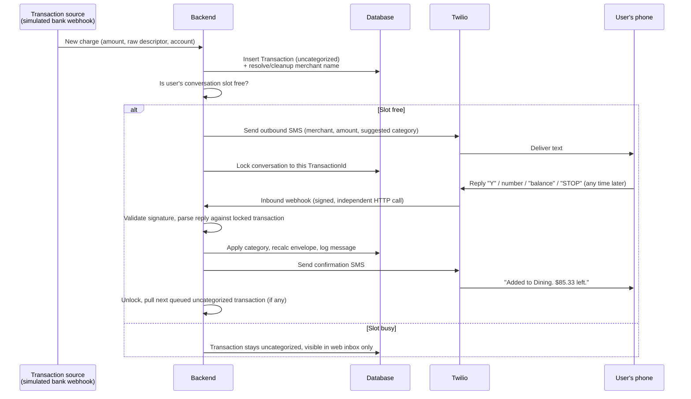

# SMS Categorization — Engineering Spec

Status: Draft, not yet implemented. Written from a design discussion on 2026-09-14.
Owner decisions still open are marked `TBD` in Section 9.

## 1. Intent

Give the user an interactive text-message conversation for every new credit-card
charge: the app texts a cleaned-up merchant name and a suggested category, the
user replies, the envelope updates, and the app confirms the new balance. This
replaces passive bank alerts with a moment of deliberate categorization, per the
product definition (`connected_budget_product_definition.html`, section 9).

This spec covers the SMS delivery mechanism, the conversation/queueing rules,
and the data it reads and writes. It does not cover the AI batch-review
assistant (web-based, Claude-powered, already specified in product doc section 7)
or the bank-data connection itself (still simulated).

## 2. Scope

**In scope**
- Real two-way SMS via a single provider integration, abstracted behind an
  `ISmsProvider` interface (per the product doc's isolation principle in
  section 11).
- Server-owned conversation state: which transaction is "active" for a user's
  phone number, and a queue of what's next.
- Inbound webhook endpoint, signature validation, rules-based reply parser.
- Consent capture and opt-out (`STOP`/`HELP`) handling.
- Message audit log.

**Out of scope for this spec**
- Natural-language reply understanding (e.g. free-text merchant corrections)
  — SMS replies are constrained to short commands; free-form correction stays
  a web-app / Claude-assistant feature.
- Multi-country numbers or carriers outside the US.
- Any change to the existing budget-setup wizard (`BudgetSetupController`,
  `BudgetProfile`/`BudgetCategory`) beyond what's needed to give SMS something
  real to read from.

## 3. Prerequisite: real Transaction/Category tables

Today, `Transaction`, `Category` (the budgeting kind, not `BudgetCategory`),
and the SMS log only exist inside the per-username JSON blob written by
`PrototypeController` (`budget_accounts.data`). That storage model only ever
changes when a browser tab PUTs a new blob — nothing server-side can react to
an event on its own.

A real inbound text arrives at the backend independent of any browser being
open. So this feature requires promoting transactions, categories, and SMS
state out of the JSON blob into real tables the server can read and write
without a browser in the loop. This is treated as part of this feature, not a
separate prerequisite project.

## 4. Conceptual model

| Entity | Purpose | Notes |
|---|---|---|
| `Transaction` | A charge from the (simulated, later real) bank feed | Needs `category_id` (nullable), `cleaned_merchant`, `raw_description`, `amount`, `status` |
| `Category` | Budgeting envelope | **Decision (2026-09-14): extend the existing `BudgetCategory` table** with `openingBalance`, `warningThreshold`, and `archived` columns rather than creating a separate table — the setup wizard's categories become the live envelopes, single source of truth |
| `sms_consent` | One row per user | Phone number (E.164), consent timestamp, consent method, opt-out timestamp (nullable) |
| `sms_conversations` | One row per user | `active_transaction_id` (nullable lock), `locked_at` |
| `sms_messages` | Append-only log | Direction, body, linked `transaction_id` (nullable), provider `MessageSid`, delivery status, `created_at` |

## 5. Trigger flow

## 6. Behavior definitions

### 6.1 Conversation lock
- At most one "active" transaction per user at a time. A new charge only
  triggers an outbound text if the user's `sms_conversations` row has no
  `active_transaction_id`.
- While locked, additional new charges are inserted as `uncategorized` but do
  **not** send a text — they wait, visible in the web inbox (already a rule
  in the product doc, section 9).
- On categorization (or explicit skip via the web app), the lock clears and
  the oldest remaining uncategorized transaction is promoted and texted.

### 6.2 Reply parsing (rules-based, not Claude)
The parser only ever interprets a reply in the context of the currently
locked transaction. Supported inputs, matching product doc section 9:
- `Y` / `YES` → confirm the suggested category.
- A digit → pick from the numbered category menu (sent on request or after
  an unrecognized reply).
- `M` → send/re-send the numbered menu.
- `BALANCE` → reply with the current envelope balance, does not consume the lock.
- `SUMMARY` → reply with a monthly summary, does not consume the lock.
- Free text that doesn't match any of the above → re-send the menu with a
  short "didn't understand" prefix. Does not silently guess.
- `STOP` / `HELP` → handled per Section 7 (compliance), independent of any lock.

Claude is deliberately not in this path: SMS replies must be answered inside
Twilio's per-request timeout window (see Section 8), and the vocabulary is
small and fixed. Natural-language correction stays a web/Claude feature.

**Decision (2026-09-14): duplicate-confirmation and manual-charge-add-by-text
are deferred to v2.** The product doc lists both as supported interaction
goals, but the existing `SmsSimulator` doesn't model either yet, and keeping
v1's parser to the four commands above keeps the first real implementation
slice smaller.

### 6.3 Timeout / staleness of a locked conversation
**Decision (2026-09-14): no automatic timeout for v1.** Nothing unlocks a
conversation except a valid reply. An unanswered text just means the next
charge waits in the inbox, and the user can also categorize the active
transaction from the web app, which clears the lock the same as an SMS reply
would. Revisit if real usage shows charges piling up behind an ignored text.

### 6.4 Merchant cleanup & category suggestion at ingestion
**Decision (2026-09-14): check the per-user remembered merchant→category
mapping first; only call Claude when the merchant has no remembered mapping.**
This runs when the transaction is first ingested — before any decision to
send a text — so it is never inside Twilio's reply-timeout window (Section 8).
Cheaper and consistent with the product doc's rule that a user's own
corrections take priority over AI suggestions going forward.

### 6.5 Pending vs. posted trigger
**Decision (2026-09-14): fire the SMS trigger on pending status**, matching
the product doc's "as soon as the provider reports a transaction." If the
amount or merchant changes before the charge posts, send a short correction
follow-up text (e.g. "Update: that Chipotle charge posted as $19.05, not
$18.42 — envelope adjusted."). Exact wording/threshold for what counts as a
meaningful change is left to implementation.

## 7. Compliance & security

- **Consent**: capture at onboarding (checkbox tied to the phone number step),
  written to `sms_consent` with timestamp and method. No outbound SMS sends
  without an active consent row.
- **STOP/HELP**: Twilio provides built-in carrier-required auto-responses for
  registered 10DLC numbers; confirm this is active rather than
  re-implementing it. Regardless, an inbound `STOP` must also flip
  `opted_out_at` in `sms_consent` so the app itself stops attempting sends.
- **Webhook signature validation**: every inbound request to
  `POST /api/sms/inbound` must validate Twilio's `X-Twilio-Signature` header
  using the official SDK helper before touching any data. Unsigned or
  invalid requests are rejected, not processed.
- **No sensitive data in message bodies**: raw bank descriptor, account
  number, routing/card numbers, and bank credentials never appear in an SMS.
  Only cleaned merchant name, amount, category, and balance.
- **Secrets**: Twilio auth token and API keys go through user-secrets /
  environment config, never committed, consistent with existing
  `appsettings.Development.json` handling.

## 8. Timeout window clarification

Twilio's webhook timeout (documented default: server must respond within its
configured `readTimeoutMs`, historically ~15s) applies **per HTTP request**,
i.e. to how quickly the backend must answer Twilio's call for a single inbound
message event. It is not a deadline for the person to reply — a reply sent
minutes or days later is simply a new, independent webhook call with its own
timeout. The only real "how long" product question is the conversation-lock
staleness question in Section 6.3, which is a product choice, not a platform
constraint.

## 9. Provider & cost model

**Correction (2026-09-14, superseding the original recommendation below):**
toll-free was the wrong call for a no-EIN individual. Toll-free verification
routes through Twilio's Trust Hub Compliance Profile, and **both** the
Individual and Business profile types there ultimately require a real
business Tax ID (EIN or equivalent) to complete — confirmed live by hitting
the actual form, not assumed. There is no toll-free path for an individual
without an EIN.

**Actual decision: a regular local (10DLC) number, registered under an A2P
10DLC "Sole Proprietor" Brand.** This is confirmed via Twilio's own Help
Center as the officially supported product for exactly this situation — "If
you're an individual or small business without a Tax ID (EIN)... register as
a Sole Proprietor Brand" — not a workaround. Requirements: name, email,
phone, US/Canada address (P.O. box OK), and OTP verification sent to your
own personal mobile number. No business documents needed. Fees: $4 one-time
Brand + $15 one-time Campaign vetting + $2/month — cheaper than the toll-free
rental this replaces. Throughput cap is 1 message/second (~3,000+
segments/day), well above the ~183 msgs/day estimated for 50 users below.
Real-world reports (r/twilio) put Twilio's own vetting at anywhere from a
few days to a couple of weeks.

Recommended provider: still **Twilio**, but a local number + Sole Proprietor
Brand/Campaign, not a toll-free number. Confirm current pricing/verification
steps at signup; figures below are planning estimates.

**Decision (2026-09-14): one shared number for all users**, routed by the
sender's (From) phone number — not a dedicated number per user. Per-user
numbers were considered; their only real benefits (carrier-reputation
isolation, higher aggregate throughput) don't apply at dozens-of-users
volume, and they add real per-number rental cost and per-number registration
overhead that would slow down onboarding new users.

**Decision (2026-09-14, corrected): register an A2P 10DLC "Sole Proprietor"
Brand** (not a toll-free verification, not a Business Profile) — the
officially supported Twilio path for an individual without an EIN. Identity
check is OTP verification to your own personal mobile number, not a
government ID or business documents. Turnaround for Twilio's own vetting is
typically days to a couple of weeks per real-world reports.

| Scenario | Users | Msgs/user/mo | Total msgs/mo | Rough monthly cost |
|---|---|---|---|---|
| Prototype (you only) | 1 | ~110 | ~110 | ~$0 (trial credit) |
| Early real users | 10 | ~110 | ~1,100 | ~$10–12 |
| "Dozens of users" | 50 | ~110 | ~5,500 | ~$45–50 |

Basis: ~30 transactions/user/month, ~3 messages per transaction (alert →
reply → confirmation), plus a buffer for balance/summary/menu requests.

## 10. Implementation phases

1. Promote `Transaction`/`Category` out of the JSON blob into real tables
   (seed/import existing prototype data so nothing is lost). **Done.**
2. Add `sms_consent` table + onboarding consent checkbox. **Done.**
3. Create Twilio trial account, register an A2P 10DLC Sole Proprietor Brand +
   Campaign, buy a local number, set up ngrok (or equivalent) for local
   webhook delivery during development. **Paused 2026-09-14 — see Section 12.**
4. `ISmsProvider` abstraction + Twilio implementation; outbound send wired to
   transaction ingestion + conversation-lock check.
5. `POST /api/sms/inbound` webhook: signature validation, reply parser,
   category application, confirmation send, lock release/promote-next.
6. Keep the existing browser-only `SmsSimulator` UI as-is, as a separate
   offline demo mode that coexists with the real SMS path (decision below) —
   it doesn't get pointed at the real message log or retired.

## 11. Decisions log

All open decisions from the first draft were resolved on 2026-09-14:

- **Category table**: extend `BudgetCategory` into the live envelope table (Section 4).
- **Conversation lock timeout**: no timeout for v1 (Section 6.3).
- **Merchant cleanup / Claude usage**: remembered mapping first, Claude fallback only when unknown (Section 6.4).
- **Pending vs. posted trigger**: fire on pending, send a correction follow-up if it changes before posting (Section 6.5).
- **V1 SMS command scope**: defer duplicate-confirmation and manual-add-by-text to v2 (Section 6.2).
- **Shared vs. per-user number**: one shared number for all users (Section 9).
- **Number type & registration path**: local (10DLC) number + A2P 10DLC Sole Proprietor Brand, not toll-free (Section 9, corrected after hitting the real Twilio flow).
- **Opt-in method for Campaign registration**: Web Form — the SMS consent checkbox already built in Section 7/Phase 2 (onboarding + Settings) *is* the web-form opt-in. Not verbal consent.
- **SmsSimulator UI fate**: kept as a separate offline demo mode, not retired (Section 10).

## 12. Twilio account status (paused 2026-09-14)

**Why paused:** Campaign registration requires live public URLs for a Privacy
Policy and a Terms & Conditions page (each with specific mandated legal
language, and each must mention the registered Brand name). Tally has no
public URL yet. Rather than fake these pages, this phase is paused until
Tally has a real deployment (even minimal) to host them on.

**Already done and live in the Twilio account (do not redo on resume):**

| Resource | Value | Status |
|---|---|---|
| Twilio account | Pay-as-you-go, $20 balance, auto-recharge at $10 → $20 | Active |
| Compliance profile | "Tally SMS Integration", Individual, SID `BUf3b9fba80e9cf66c76888873add8336a` | Approved |
| A2P 10DLC Brand | "Tally SMS Integration", Sole Proprietor, SID `BN4737734492d3032c423a8b77d476cb2f` | Approved, Identity Verified |
| Messaging Service | "Tally SMS", SID `MG46930a3f9a9d610595277a423fa2100f` | Created, no Campaign yet |
| Campaign | — | Not yet submitted — stopped at the "Message flow" step needing privacy/terms URLs |

Messaging limits confirmed for this Brand: <3,000 outbound segments/day
across major US carriers, <1,000/day to T-Mobile, exactly one 10DLC phone
number may be attached per Sole Proprietor Campaign.

**To resume:**
1. Get Tally a real public URL (production deploy, or even a minimal one).
2. Write and host a Privacy Policy page (must state "We do not sell or share
   your SMS opt-in data or personal information with third parties for
   marketing purposes" and mention "Tally SMS Integration") and a Terms &
   Conditions page (must include an SMS Terms section and a "message and
   data rates may apply" disclosure).
3. Go to Trust Hub → Registrations → A2P 10DLC → Campaigns (or
   `console.twilio.com/us1/develop/sms/regulatory-compliance/campaigns`),
   resume the Campaign for the "Tally SMS" Messaging Service, opt-in method
   = Web Form, paste in the two URLs, provide 2 sample messages matching the
   product doc's SMS examples (Section 9 of the product doc), and submit.
4. Wait for manual vetting (days, per Twilio's own timeline).
5. Buy a local number (~$1.15/mo) and attach it to the Messaging Service.
6. Only then does Phase 4 (`ISmsProvider` + outbound send) have a real
   number to send from.

Exact toll-free verification turnaround time remains an operational unknown
to confirm at signup — not a design decision, so it isn't blocking further spec work.

## 12. Definition of done (for this feature)

- A simulated new charge results in a real text arriving on the developer's
  phone within the same request cycle that inserts the `Transaction` row.
- A real reply from that phone updates the category, envelope balance, and
  produces a confirmation text, end to end, without a browser open.
- A second charge arriving while the first is unanswered does not send a
  text and appears only in the web inbox.
- `STOP` from the phone halts future sends for that number without code
  changes required.
- Signature validation rejects a forged request to the inbound webhook.
